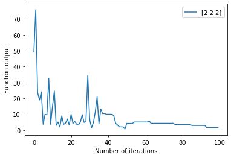
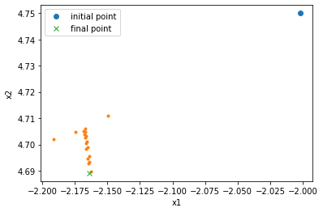
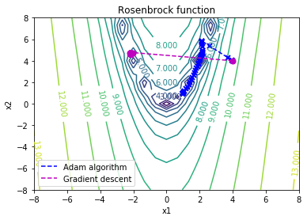
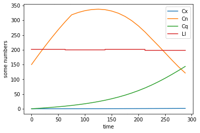

# Design of Computational Optimisation Algorithms
### About Me and Project Scope

Final-year MEng Chemical Engineering undergraduate at Imperial College London working on this side-project under the supervision of Dr Antonio Del Rio Chanona during Oct-Dec 2019. The purpose of this project is to introduce myself to Python programming and explore various computational optimisation technqiues. The following algorithms have been coded: Simulated Annealing, Gradient Descent, Adam, BFGS and Dynamic Optimisation. My repository is broken down into different "milestones" representing the chronological order in which this work develops. Some basic background and discussion can be found in this ReadMe complementing the attached Python files. 

## Milestone 1  

Goal to code two local search algorithms in 2d: 
- Simulated annealing 
- Gradient descent 

And implement them on minimising two test-functions: 
- Simple sum-of-squares function (convex)
- Rosenbrock function (non-convex)

### Simulated Annealing

Randomly take N sample points normally distributed within a finite region of a "starting point": 

Evaluate the function at all these sample points and select the minimum. If the minimum is lower than the function evaluation at the starting point, then update this best sample point to be the new starting point for the next iteration of the algorithm.

If not then compute:

where c is the change in the evaluation function and T is the current temperature. If P > r (some set criteria between 0 and  1) then accept the sample point as the new starting point, even if it is worse than the original starting point/trial solution. 

Additionally, the temperature is a function of the number of iterations - it starts high and decreases - in my code according to: 

where  is a "cooling rate" which reduces the temperature like a geometric progression. The result of this is that at the beginning the algorithm has a high chance of accepting a 'worse' solution to avoid getting stuck in local optima, however, the temperature needs to lower with increasing iterations so that the algorithm tightens towards only accepting better solutions. 

### Gradient Descent 

The gradient descent algorithm works on the principle that the gradient of a scalar-function is a vector field that gives the greatest rate of change; therefore, to traverse towards the minima we wish to follow the updates on each iteration of: 

Here alpha is the "learning rate" and the negative sign shows us we are travelling towards the minimum along the steepest path of gradient descent. 

## Milestone 2 

The milestone 2 code file builds upon the computational optimization techniques explored in milestone 1 to: 
- Vectorise the gradient descent and simulated annealing algorithms to higher dimensions (i.e. extending them from taking an input of a 2d vector to being able to process a n-dimension vector/function) 
- Improve the gradient descent algorithm through introduction of "backtracking" - this involves adjusting the "alpha" (learning rate) in the algorithm such that the result from the next iteration is always better than the previous one 
- Visualise some analysis of the algorithms. For example, the figure on the left shows how the output of the simulated annealing algorithm behaves as a function of the number of iterations for a minimisation problem. And the figure to its right shows how a 2d search space is explored by a gradient descent algorithm.

 

The image on the left illustrates the above discussion that initially the simulated annealing algorithm will accept worse solutions to avoid getting stuck in local optima, however, later on it attempts to tighten towards a global optima. 

### Backtracking 

With a small enough learning rate (alpha) the objective function should monotonically decrease by following gradient descent, however, if the learning rate is too large the solution can diverge away from any optima, so if the updated evaluation of the function does not provide a better solution then we follow: 

<a href="https://www.codecogs.com/eqnedit.php?latex=f(X_{t&plus;1})&space;-&space;f(X_t)&space;>&space;0&space;\rightarrow&space;\alpha&space;=&space;\alpha/2" target="_blank">&space;0&space;\rightarrow&space;\alpha&space;=&space;\alpha/2" title="f(X_{t+1}) - f(X_t) > 0 \rightarrow \alpha = \alpha/2" /></a>

Alpha is halved until the updated solution is better than the original trial solution. The milestone 2 code file presented stores the history of "successful" alphas used and the starting trial value for alpha for the next iteration is taken as:

 

The times 2 ensuring alpha doesn't only decrease, as the trade-off of too small an alpha is that it can take too many iterations for the algorithm to reach the solution.

## Milestone 3 

### Adam Optimisation

Implemented the "Adam" (adaptive moment estimation) algorithm - this is a combination of the gradient descent with momentum and RMSprop algorithms. (Additionally, backtracking has been included.)

The key concepts behind Adam can be summarised in the following 3 equations: 

The 1st equation is an implementation of gradient descent with momentum - where exponetially weighted averaging is used. Then the 2nd equation is an implementation of the RMSprop algorithm. Finally equation 3 combines these two techniques into the gradient descent update step. The algorithm loops through these computations for n iterations. 

Adam shows significantly improved performance than a simple gradient descent algorithm (even with backtracking), as illustrated by convergence to the (1,1) minima on the Rosenbrock test function in the figure below: 

## Milestone 4 

### BFGS Algorithm 

Implemented the BFGS algorithm - this is a quasi-Newton method. Along the line of algorithms coded in the previous weeks (gradient descent and the Adam algorithm) the BFGS method also employs a line search strategy. This means the algorithm chooses a direction to search along to find a new iterate with a lower objective function value. 

The BFGS algorithm is a development on Newton's method which can be summarised with the equation: 

A significant drawback, however, of Newton's method is that it is computationally intesive - both computing the Hessian and inverting that result is computationally expensive. The BFGS algorithm implemented is more efficient as it avoids both of these operations. The BFGS approach uses the structure: 

where the BFGS formula for updating the Hessian approaximation is: 

with: 

However, this would still require inverting a matrix so the BFGS algorithm proposes the formulation:

These equations are implemented in the milestone 4 code. To actually implement this algorithm one needs an initial approximation for . I have used a basic gradient descent step for the first 2 iterations as a "warming up phase" before transitioning into the BFGS algorithm. 

The below plots show the performance of this algorithm vs the Adam algorithm tested on the Rosenbrock function, which has a global minima evaluating to 0. The left figure represents how the objective function is minimised for a 2d test function, with starting point X0 = (4,4) and the right one is an extension to higher dimensions (4d), with a starting point X0 = (2,2,2,2)

.png) .png)

## Milestone 5 

